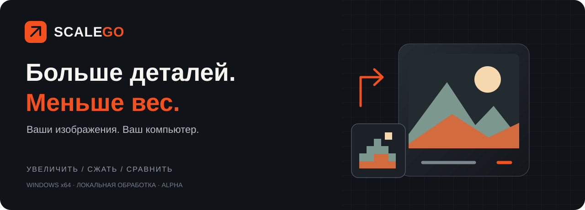
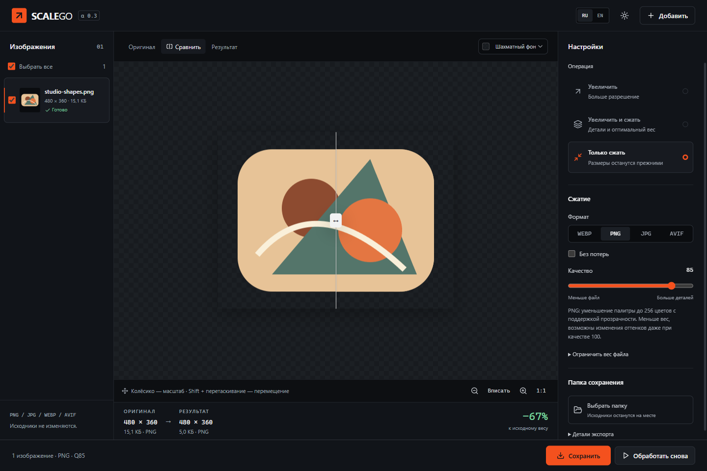
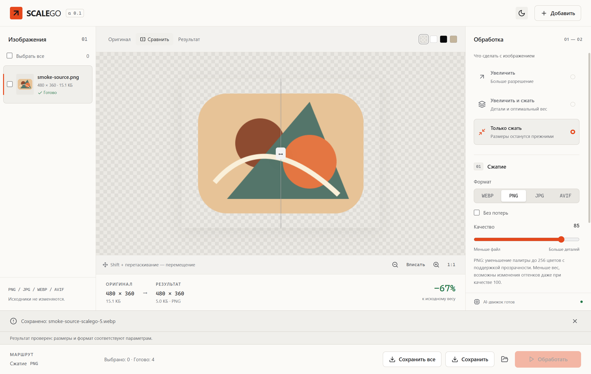

  
  
<strong>Увеличивайте изображения и готовьте их к публикации — в одном окне.</strong> AI-увеличение, сжатие PNG / JPG / WebP / AVIF и сравнение до/после. Всё локально.

  
<a href="https://github.com/Oceannin/SCALEGO/releases"><strong>Скачать для Windows</strong></a> · <a href="#за-минуту-до-первого-результата">Быстрый старт</a> · <a href="#посмотрите-как-это-работает">Посмотреть приложение</a> · <a href="docs/README.md">Документация</a>

  
<code>Windows x64</code> &nbsp; <code>Alpha</code> &nbsp; <code>Без аккаунта</code> &nbsp; <code>Без загрузки в облако</code>

## Из исходника — в готовый файл

Маленькая иллюстрация для обложки. Тяжёлый PNG для сайта. Папка изображений, которую нужно подготовить разом. SCALEGO соединяет увеличение и сжатие в одну очередь: вы выбираете параметры, видите результат и сохраняете только то, что подходит.

| Нужно… | Выберите | Что получите |
| :--- | :--- | :--- |
| Больше разрешение | **Увеличить** | 2×, 3× или 4×; PNG без потерь после обработки |
| Увеличить и подготовить к публикации | **Увеличить и сжать** | Увеличенный файл в выбранном формате с настройкой качества |
| Уменьшить вес | **Только сжать** | PNG, JPG, WebP или AVIF с прежними размерами |

**Исходники остаются на месте.** Приложение работает с копиями, а экспорт не перезаписывает существующие файлы.

## Посмотрите, как это работает

На этом тестовом рисунке PNG стал **15,1 → 5,0 КБ** при качестве 85. Размеры **480 × 360** и поддержка прозрачности сохранены. Это реальный результат приложения на собственном тестовом рисунке, а не обещание одинаковой экономии для любых изображений. Палитровый PNG может менять оттенки.

<strong>Предпочитаете светлую тему?</strong>

### Больше контроля над результатом

- **Сравните перед сохранением.** Двигайте разделитель до/после, проверьте детали в масштабе 1:1 и прозрачные края на разных подложках.
- **Подберите размер файла.** Настройте качество или задайте лимит в КБ. Если достичь лимита не получилось, вы увидите предупреждение.
- **Обработайте целую подборку.** Выберите несколько изображений, запустите очередь и сохраните последние готовые результаты вместе. Прерванную очередь можно продолжить после запуска приложения.
- **Выберите способ увеличения.** Real-ESRGAN для иллюстраций и фотографий; Lanczos для обычного увеличения; Nearest для пиксель-арта.
- **Сохраните параметры.** Вместе с изображением экспортируется файл `.scalego`: формат, качество, размеры и контрольные суммы результата. Импорт рецептов пока не поддерживается.

## Скачать

**[Открыть загрузки SCALEGO →](https://github.com/Oceannin/SCALEGO/releases)**

| Пакет | Как запустить |
| :--- | :--- |
| `SCALEGO-0.1.0-alpha.1-Portable.exe` | Скачать и открыть — установка не нужна |
| `SCALEGO-0.1.0-alpha.1-Setup.exe` | Установить в выбранную папку |
| `SHA256SUMS.txt` | Проверить целостность скачанного файла |

Windows x64. Модели AI включены; изображения обрабатываются без интернета. Для AI нужны совместимый Vulkan-драйвер и [Microsoft Visual C++ Runtime x64](https://learn.microsoft.com/en-us/cpp/windows/latest-supported-vc-redist). Установите Runtime с сайта Microsoft, если его ещё нет в системе. Обычное увеличение и сжатие доступны без Vulkan. Интерфейс — на русском языке.

> **Ранняя alpha.** Windows-файлы не подписаны цифровой подписью. Перед запуском сверяйте источник и контрольную сумму. Совместимость проверена на одной Windows 11 машине; работа со всеми видеокартами не заявляется. [Требования и ограничения](docs/USER_GUIDE.md#требования-и-ограничения).

Portable не требует установки, но хранит рабочую сессию в профиле Windows, а не рядом с EXE. [Где находятся рабочие файлы](docs/USER_GUIDE.md#ваши-файлы-и-приватность).

## За минуту до первого результата

1. Откройте SCALEGO и добавьте изображения кнопкой **«Добавить»** или перетаскиванием.
2. Выберите **«Увеличить»**, **«Увеличить и сжать»** или **«Только сжать»**.
3. Укажите масштаб, формат и качество. Для первого опыта со сжатием начните с качества **85**.
4. Нажмите **«Обработать»**. Сравните изображение и фактический вес.
5. Нажмите **«Сохранить»** и выберите папку.

### Какой формат выбрать?

| Формат | Когда полезен | Что учитывать |
| :--- | :--- | :--- |
| **PNG** | Иллюстрации, скриншоты, прозрачная графика | Для меньшего веса выключите «Без потерь». Палитра ограничивается до 256 цветов; возможны изменения оттенков даже при качестве 100 |
| **JPG** | Фотографии без прозрачности | Сжатие с потерями; прозрачные участки заменяются выбранным фоном |
| **WebP** | Изображения с прозрачностью и компактная веб-графика | Есть сжатие с потерями и без потерь |
| **AVIF** | Компактные изображения для совместимых приложений | Кодирование может занимать больше времени; проверьте поддержку у получателя |

«Без потерь» сохраняет **подготовленные пиксели**: выход нормализуется в sRGB, 8 бит на канал, без исходных EXIF/ICC. Увеличение может сделать файл тяжелее исходника; результат AI всегда стоит проверить глазами.

## Нужна помощь?

**AI недоступен?** Проверьте Vulkan-драйвер или выберите Lanczos. **Вес не изменился?** У PNG без потерь это возможно — выключите «Без потерь» и уменьшите качество. **Обработка прервалась?** После запуска нажмите «Продолжить очередь».

[Руководство и решение проблем](docs/USER_GUIDE.md) · [Сообщить об ошибке](https://github.com/Oceannin/SCALEGO/issues/new/choose) · [Предложить улучшение](https://github.com/Oceannin/SCALEGO/issues/new?template=feature.yml)

## Для тех, кто хочет заглянуть внутрь

SCALEGO построен на Electron, React, TypeScript, Sharp/libvips и Real-ESRGAN-ncnn-vulkan. Собственные интерфейс и очередь; готовые кодеки и модели работают локально.

[Сборка из исходников](docs/DEVELOPMENT.md) · [Архитектура](docs/APPLICATION.md) · [Проверки](docs/VALIDATION.md) · [Участие в разработке](CONTRIBUTING.md) · [Изменения](CHANGELOG.md)

## Авторы и компоненты

SCALEGO — проект [Oceannin](https://github.com/Oceannin). Спасибо авторам [Real-ESRGAN](https://github.com/xinntao/Real-ESRGAN), [ncnn](https://github.com/Tencent/ncnn), [Sharp](https://github.com/lovell/sharp), [libvips](https://github.com/libvips/libvips), [Electron](https://github.com/electron/electron), [React](https://github.com/facebook/react) и [Lucide](https://github.com/lucide-icons/lucide).

Лицензии компонентов и происхождение моделей: [Third-party notices](THIRD_PARTY_NOTICES.md). Лицензия собственного кода пока не назначена; лицензии зависимостей не распространяются автоматически на SCALEGO.
