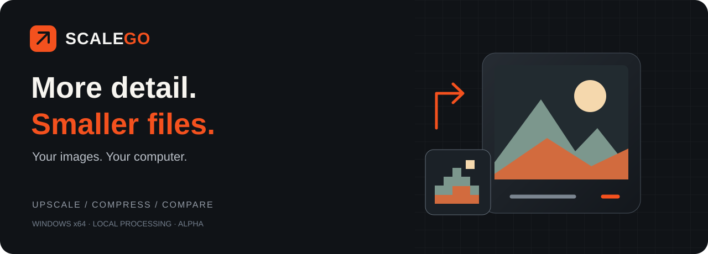
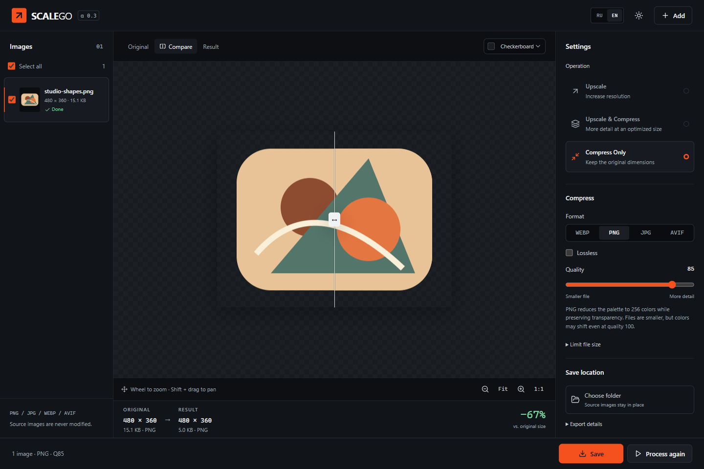
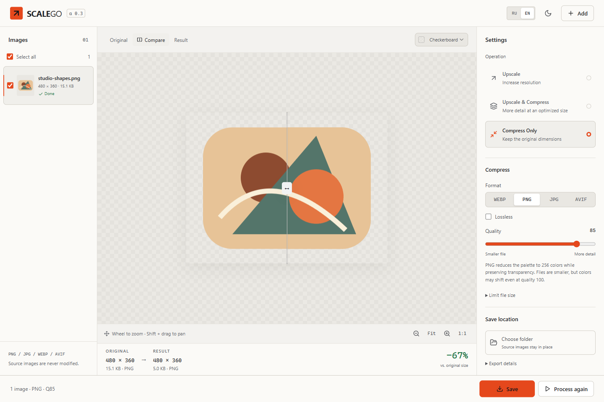

[English](README.md) | [Русский](README.ru.md)

<div align="center">
  
  <p><strong>Upscale images and prepare them for publishing — in one window.</strong><br/>AI upscaling, PNG / JPG / WebP / AVIF compression, and before/after comparison. All local.</p>
  <p><a href="https://github.com/Oceannin/SCALEGO/releases"><strong>Download for Windows</strong></a> · <a href="#workflow">Quick start</a> · <a href="#see-it-in-action">See the app</a> · <a href="docs/README.md">Documentation (RU)</a></p>
  <p><code>Windows x64</code> &nbsp; <code>Alpha</code> &nbsp; <code>No account</code> &nbsp; <code>No cloud uploads</code></p>
</div>

## From source image to finished file

SCALEGO is a local Windows workstation for enlarging, compressing, comparing, and exporting images. It combines conventional resizing with optional AI upscaling and keeps the processing workflow on your computer.

> Current release: [v0.3.0-alpha.1](https://github.com/Oceannin/SCALEGO/releases/tag/v0.3.0-alpha.1).

| Need to… | Choose | Get |
| :--- | :--- | :--- |
| Increase resolution | **Upscale** | 2×, 3×, or 4× enlargement, saved as lossless PNG |
| Enlarge and prepare for publishing | **Upscale & Compress** | A larger image in your chosen format with quality controls |
| Reduce file size | **Compress Only** | PNG, JPEG, WebP, or AVIF with the original dimensions |

**Your source files stay intact.** Compare the result before saving it.

## See it in action



<details>
<summary><strong>Prefer a light theme?</strong></summary>



</details>

**Captured in v0.3.0-alpha.1.** This sample PNG went from **15.1 to 5.0 KB** at quality 85, keeping its **480 × 360** dimensions and transparency support. Results vary by image; palette compression can change colors and alpha values.

## Features

- Three workflows: upscale, upscale and compress, or compress without changing dimensions.
- Side-by-side comparison with a draggable split, Original/Result views, Fit and 1:1 zoom, mouse-wheel zoom, and selectable preview backgrounds.
- Batch workspace for up to 200 images, with processing and export actions scoped to the current selection.
- Five bundled AI profiles, plus Lanczos and Nearest resizing without AI.
- PNG, JPEG, WebP, and AVIF output with quality, lossless, transparency, and optional file-size controls where the selected format supports them.
- English and Russian interface, an in-app language switch, and a persisted language preference.
- Light and dark themes, queue recovery, local session storage, and `.scalego` processing records beside exported images (recipe import is not supported yet).

## Download and installation

Choose a **Windows x64** package from [v0.3.0-alpha.1](https://github.com/Oceannin/SCALEGO/releases/tag/v0.3.0-alpha.1):

| Download | How to use it |
| :--- | :--- |
| [Portable executable](https://github.com/Oceannin/SCALEGO/releases/download/v0.3.0-alpha.1/SCALEGO-0.3.0-alpha.1-Portable.exe) | Download and run; no installation needed |
| [Windows installer](https://github.com/Oceannin/SCALEGO/releases/download/v0.3.0-alpha.1/SCALEGO-0.3.0-alpha.1-Setup.exe) | Install in your chosen folder |
| [SHA256SUMS.txt](https://github.com/Oceannin/SCALEGO/releases/download/v0.3.0-alpha.1/SHA256SUMS.txt) | Check the downloaded file's SHA-256 hash |

Both packages include all five AI profiles. **Early alpha:** builds are not digitally signed; GPU compatibility has not been verified across all devices.

AI upscaling requires a compatible Vulkan GPU, a current graphics driver, and the [Microsoft Visual C++ Redistributable x64](https://learn.microsoft.com/en-us/cpp/windows/latest-supported-vc-redist). Compression, Lanczos, and Nearest do not require the AI engines. macOS and Linux packages are not provided.

Portable stores its session and working copies in `%APPDATA%/scalego/`, not beside the executable. Processing stays on your computer; no account or API key is needed.

## Workflow

1. **Add** one or more images with the Add button, file picker, or drag and drop.
2. **Configure** the selected images: choose Upscale, Upscale & Compress, or Compress Only; then set the relevant scale, method, model, format, and export options.
3. Select **Process**. Changing a processing setting after a result is ready marks that result as outdated and makes Process the primary action again.
4. **Compare** the original and result with the split view, zoom controls, and preview background selector.
5. **Save** the finished result. For one image, use Save. With multiple images, Save selected exports the selected finished results, while Save all exports the latest finished result for every source.

Source files are never overwritten. If no output folder has been chosen, SCALEGO asks for one when you save.

## AI models and resize engines

The Windows packages bundle both native Vulkan engines and all five model profiles. A source checkout does not contain the runtime until `npm run engine:install` downloads the pinned official archives and verifies their SHA-256 hashes.

| Profile | Best suited to |
| --- | --- |
| Photo · Natural | Softer, more natural photo detail |
| Photo · Detailed | Stronger photo detail |
| Illustration · Clean | Clean lines and denoising |
| Illustration · Detailed | Detailed illustration and anime |
| Fast | Fast previews and lightweight graphics |

<details>
<summary><strong>Engine names and native scales</strong></summary>

| Profile | Best suited to | Engine / model | Native scale | Available scale |
| --- | --- | --- | --- | --- |
| Photo · Natural | Softer, more natural photo detail | Real-ESRGAN / `realesrnet-x4plus` | 4× | 2×, 3×, 4× |
| Photo · Detailed | Stronger photo detail | Real-ESRGAN / `realesrgan-x4plus` | 4× | 2×, 3×, 4× |
| Illustration · Clean | Clean lines and denoising | Real-CUGAN SE, denoise3 | 2×, 3×, 4× | 2×, 3×, 4× |
| Illustration · Detailed | Detailed illustration and anime | Real-ESRGAN / `realesrgan-x4plus-anime` | 4× | 2×, 3×, 4× |
| Fast | Fast previews and lightweight graphics | Real-ESRGAN / `realesr-animevideov3` | 2×, 3×, 4× | 2×, 3×, 4× |

</details>

The 4×-native profiles accept sources up to **6.25 megapixels**, even for a 2× or 3× result: they run at 4× first, then apply one Lanczos downscale. AI may reconstruct fine detail rather than preserve it exactly, so inspect text, faces, thin lines, and transparency before export. The alpha channel is resized separately from RGB.

Lanczos and Nearest run without the AI runtime. See the [model and licensing audit](docs/MODEL_AUDIT.md) and [multi-engine notes (RU)](docs/MULTI_ENGINE.md) for implementation details.

## Formats and limits

- Static PNG, JPEG, WebP, and AVIF images are supported; animated images, RAW files, and video are not.
- Each source may be up to 200 MB and 40 megapixels. A result may be up to 100 megapixels and 32,768 pixels on either side; available memory can impose a lower practical limit.
- Upscale-only always produces a lossless PNG. Upscale & Compress and Compress Only can produce PNG, JPEG, WebP, or AVIF.
- JPEG is always lossy and replaces transparency with the selected background. WebP and AVIF support lossy and lossless export. Lossy PNG uses palette reduction and can alter colors and alpha values.
- A file-size target adjusts quality without reducing dimensions and is not guaranteed to be achievable. In lossless mode, the target is checked but quality is not reduced.
- Output is sRGB, 8 bits per channel. EXIF and the source ICC profile are not retained.

## Need help?

| Problem | Try this |
| :--- | :--- |
| AI is unavailable | Check the graphics driver and Visual C++ Runtime, or choose Lanczos |
| PNG is not getting smaller | Turn off Lossless, lower quality, and compare the result |
| The file-size target cannot be met | Increase the target or try another output format |
| Processing was interrupted | Reopen SCALEGO and select Resume Queue |

[User guide (RU)](docs/USER_GUIDE.md) · [Report a bug](https://github.com/Oceannin/SCALEGO/issues/new/choose) · [Changelog](CHANGELOG.md)

## Development

Built with **Electron, React, TypeScript, Sharp/libvips, Real-ESRGAN, and Real-CUGAN**.

<details>
<summary><strong>Build from source and run checks</strong></summary>

Requirements: Windows x64, Node.js 24, npm, and internet access for dependencies and the optional AI runtime. No API key or `.env` file is required.

```powershell
git clone https://github.com/Oceannin/SCALEGO.git
cd SCALEGO
npm ci
npm run engine:install
npm run dev
```

`npm run dev:web` opens the React interface without Electron; file processing is available only in Electron. To work without AI, omit `engine:install` and choose Lanczos, Nearest, or compression-only processing.

Run the same baseline checks as CI before opening a pull request:

```powershell
npm run typecheck
npm test
npm run build
```

`npm run dist:win` builds the Windows Portable and NSIS packages after the runtime is installed. It prepares local artifacts only and does not publish a release. Packaging details and extended checks are documented in [Development (RU)](docs/DEVELOPMENT.md).

| Path | Responsibility |
| --- | --- |
| `src/` | React interface, localization, themes, and UI contracts |
| `electron/` | Electron main process, IPC, processing queue, codecs, AI engines, and export |
| `scripts/` | Development, runtime installation, packaging, and smoke checks |
| `tests/` | Processing, engine, queue, and export tests |
| `docs/` | User, architecture, validation, and licensing documentation |

</details>

[Architecture (RU)](docs/APPLICATION.md) · [Contributing (RU)](CONTRIBUTING.md) · [Validation notes (RU)](docs/VALIDATION.md)

## Licensing

SCALEGO is licensed under the [MIT License](LICENSE). Native engines, codecs, and model artifacts retain their own licenses and notices; see [Third-party notices](THIRD_PARTY_NOTICES.md) and the [model audit](docs/MODEL_AUDIT.md).

## Contributing and issues

Bug reports and focused feature requests are welcome in [GitHub Issues](https://github.com/Oceannin/SCALEGO/issues). Pull requests should keep user-facing behavior documented in both README files and pass the checks above. When reporting an image-processing problem, include the SCALEGO version, Windows version, GPU and driver, selected workflow, output format, and error text; attach only images you are allowed to share.
